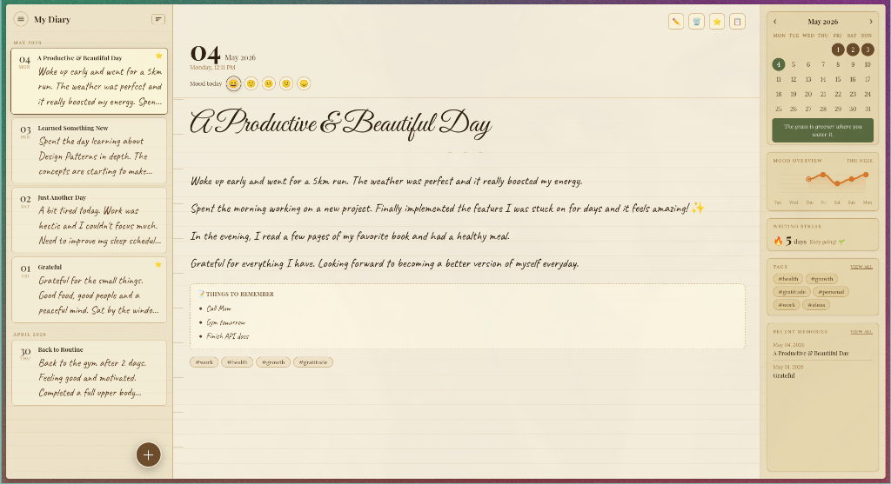

# 🪶 Ink & Impressions — Digital Diary

A high-fidelity, vintage-aesthetic digital diary built for those who appreciate the touch of classic journals in a modern digital world.



## ✨ Features

- **📜 200+ Legendary Quotes**: Daily rotating/random monologues from Ayanokoji, Mihawk, Sun Tzu, and motivational life quotes.
- **📊 Mood Overview**: A premium, smooth-area chart to track your emotional journey over the week.
- **🌓 Themes**: Vintage Paper (default) and Midnight Dark modes.
- **📱 Mobile Optimized**: Fully responsive design with slide-in overlays and touch-friendly navigation.
- **📄 PDF Export**: Export your entries as a beautifully formatted document.
- **🚀 Vercel Ready**: Optimized for serverless deployment using LocalStorage for zero-latency persistence.
- **🔍 Search & Filter**: Easily find memories by tags, dates, or moods.

## 🛠️ Tech Stack

- **Frontend**: Vanilla HTML5, CSS3 (Gradients, Glassmorphism, Animations)
- **Logic**: Vanilla JavaScript (ES6+)
- **Storage**: Browser LocalStorage (Private & Fast)
- **Deployment**: Vercel / GitHub Pages

## 🚀 Quick Start

1. Clone the repository:
   ```bash
   git clone git@github.com:Ashishdevpandey/Diary.git
   ```
2. Open `index.html` in your browser OR deploy to Vercel with one click.

## 📸 Screenshots

| Desktop View | Mobile View |
| :---: | :---: |
| _Classic 3-Column Dashboard_ | _Focus Mode Overlay_ |

---
*Created with ♡ for the art of writing.*
 
